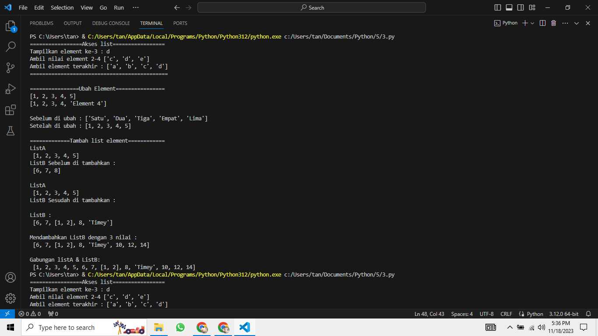
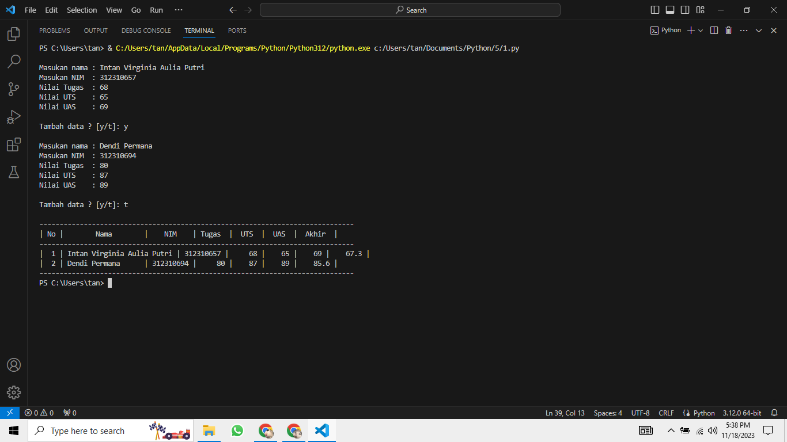
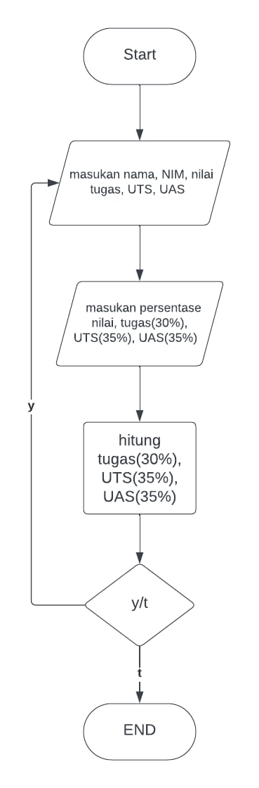

# Pertemuan ke 9

## Profil
| Variable | Isi |
| -------- | --- |
| **Nama** | Intan Virginia Aulia Putri |
| **NIM** | 312310657 |
| **Kelas** | TI.23.A.6 |
| **Mata Kuliah** | Bahasa Pemrograman |

### Latihan
#### Buat sebuah list sebanyak 5 elemen dengan nilai bebas
#### Akses list:
- tampilkan elemen ke 3
- ambil nilai elemen ke 2 sampai elemen ke 4
- ambil elemen terakhir
``` Python
print("=================Akses list=================")

# Akses list
list1 = ["a", "b", "c", "d", "e"]
print("Tampilkan element ke-3 :", list1[3]) 
print("Ambil nilai element 2-4", list1[2:5])
print("Ambil element terakhir :", list1[0:4])

print( 45*"=", "\n")
```
Penjelasan
1. `list1 = ["a", "b", "c", "d", "e"]`: Membuat list bernama `list1` yang berisi elemen-elemen huruf.
2. `print("Tampilkan elemen ke-3:", list1[3])`: Mencetak elemen ke-3 dari list (indeks dimulai dari 0).
3. `print("Ambil nilai elemen 2-4:", list1[2:5])`: Mencetak nilai elemen dari indeks 2 hingga 4 (indeks 2, 3, dan 4).
4. `print("Ambil elemen terakhir:", list1[0:4])`: Mencetak elemen dari indeks 0 hingga 3, yang merupakan elemen terakhir dalam list.
5. `print(45 * "=", "\n")`: Mencetak garis pemisah setelah selesai menampilkan informasi akses list.

#### Ubah elemen list:
- ubah elemen ke 4 dengan nilai lainnya
- ubah elemen ke 4 sampai dengan elemen terakhir
``` Python
print("================Ubah Element================")
# Ubah element
list2 = [1, 2, 3, 4, 5]
print(list2)
list2[4] = "Element 4"
print(list2)

print()

list3 = ["Satu", "Dua", "Tiga", "Empat", "Lima"]
print("Sebelum di ubah :", list3)
list3[0:6] = [1, 2, 3, 4, 5]
print("Setelah di ubah :", list3, "\n")
```
Penjelasan
1. `list2 = [1, 2, 3, 4, 5]`: Membuat list `list2` dengan elemen-elemen berupa bilangan bulat.
2. `list2[4] = "Element 4"`: Mengganti nilai elemen pada indeks ke-4 (indeks dimulai dari 0) dengan string "Element 4".
3. `list3 = ["Satu", "Dua", "Tiga", "Empat", "Lima"]`: Membuat list `list3` dengan elemen-elemen berupa string.
4. `list3[0:6] = [1, 2, 3, 4, 5]`: Mengubah elemen-elemen pada indeks 0 hingga 5 dengan nilai baru dari list `[1, 2, 3, 4, 5]`.

#### Tambah elemen list:
- ambil 2 bagian dari list pertama (A) dan jadikan list ke 2 (B)
- tambah list B dengan nilai string
- tambah list B dengan 3 nilai
- gabungkan list B dengan list A
``` Python
print("=============Tambah list element============")
# Tambah list element
#  Index   0(-5),   1(-4),  2(-3),   3(-2),   4(-1) 
lista  = [1, 2, 3, 4, 5]
print("ListA\n", lista)
listb  = [6, 7, 8]
print("ListB Sebelum di tambahkan :\n", listb, "\n")

lista  = [1 ,2 ,3 ,4 ,5]
print("ListA\n", lista)
listb  = [6 ,7 ,8 ]
listb.insert(2, lista[0:2])  
print("ListB Sesudah di tambahkan :\n", listb, "\n")

# Mendambahkan list B dengan nilai string
listb.append("Timey")
print("ListB :\n", listb,"\n")

# Menambahkan list B dengan 3 Nilai
listb.extend([10, 12, 14])
print("Mendambahkan ListB dengan 3 nilai :\n", listb,"\n")
# Menggabungkan ListA dan ListB 
listN = lista + listb
print("Gabungan listA & ListB: \n", listN)
```
Penjelasan
1. `lista = [1, 2, 3, 4, 5]`: Membuat list `lista` dengan elemen-elemen berupa angka.
2. `listb = [6, 7, 8]`: Membuat list `listb` dengan elemen-elemen berupa angka.
3. `listb.insert(2, lista[0:2])`: Menyisipkan elemen dari list `lista` pada indeks ke-2 dari list `listb`.
4. `listb.append("Timey")`: Menambahkan nilai string "Timey" ke list `listb` menggunakan metode `append`.
5. `listb.extend([10, 12, 14])`: Menambahkan tiga nilai baru ke list `listb` menggunakan metode `extend`.
6. `listN = lista + listb`: Menggabungkan list `lista` dan `listb` menjadi list baru `listN`.
7. `insert`, `append`, dan `extend`: Dapat memodifikasi atau menambahkan elemen ke dalam list sesuai dengan kebutuhan.

#### Tampilan output


### Tugas Praktikum
Buat program sederhana untuk menambahkan data kedalam sebuah list dengan rincian sebagai berikut:
- Progam meminta memasukkan data sebanyak-banyaknya (gunakan perulangan)
- Tampilkan pertanyaan untuk menambah data (y/t?), apabila jawaban t (Tidak), maka program akan menampilkan daftar datanya
- Nilai Akhir diambil dari perhitungan 3 komponen nilai (tugas: 30%, uts: 35%, uas: 35%)
- Buat flowchart dan penjelasan programnya pada README.md
- Commit dan push repository ke github
``` Python
# LIST
nama = []
nim = []
nilaiTugas = []
nilaiUTS = []
nilaiUAS = []
nilaiAkhir = []

print()

# Input
while True:
    nama.append(input("Masukan nama : "))
    nim.append(input("Masukan NIM  : "))
    Tugas = int(input("Nilai Tugas  : ")); 
    nilaiTugas.append(Tugas)
    UTS   = int(input("Nilai UTS    : ")); 
    nilaiUTS.append(UTS)
    UAS   = int(input("Nilai UAS    : ")); 
    nilaiUAS.append(UAS)

    nilaiAkhir.append(Tugas * 30/100 + UTS * 35/100 + UAS * 35/100)

    print()
    _tanya = input("Tambah data ? [y/t]: ")
    print()
    if(_tanya == "t"):
        break

# Output
print("-"*78)
print("| {0:^2} | {1:^18} | {2:^9} | {3:^6} | {4:^5} | {5:^5} | {6:^7} |".format("No", "Nama", "NIM", "Tugas", "UTS", "UAS", "Akhir"))
print("-"*78)

no = 0
for nama, nim, Tugas, UTS, UAS, nilaiAkhir in zip(nama, nim, nilaiTugas, nilaiUTS, nilaiUAS, nilaiAkhir):
    no += 1    
    print("| {0:>2} | {1:<18} | {2:>8} | {3:>6} | {4:>5} | {5:>5} | {6:>7} |".format(no, nama, nim, Tugas, UTS, UAS, nilaiAkhir))
print("-"*78)
```

#### Tampilan output


#### Flowchart

